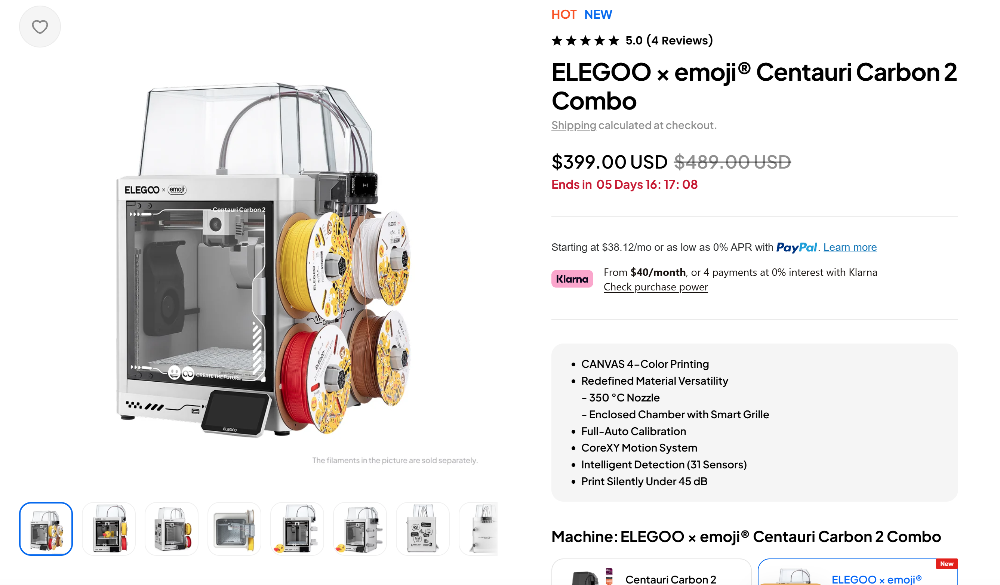
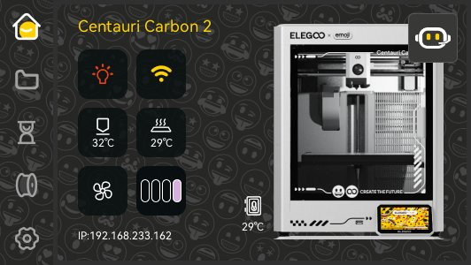
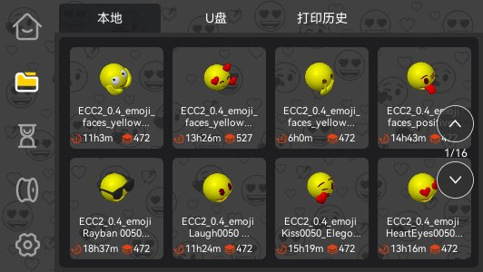

# 将打印机主题设置为emoji联动款

在分析固件时，我发现了一个有趣的东西。

固件内置了一套emoji联动主题，貌似该主题对应的是仅在部分地区限时销售的`ELEGOO × emoji® Centauri Carbon 2 Combo`版本。

从官网图片来看，该机器机身为白色，前盖玻璃以及上方塑料罩更为透明，机身上有emoji图案的贴纸，打印机开机时会显示emoji主题。



同时该机器内置了一套emoji主题，此主题实际也被编译进了普通机器的固件，仅需一些简单的办法即可切换。

# 预览

### 开机界面


### 首页



### 内置了8个emoji模型



# 切换方式

下面介绍自定义 G-code 和 SSH 两种切换方式。

**两种方式都需要在设置完成后重启整台打印机。切换前请确认打印机空闲，没有正在打印、升级或执行其他操作。**

本文只讨论固件内置界面主题的切换，不会改变机器外观，也不等于刷入联动款的完整固件。开机 Logo 和预置模型是否一起变化，取决于当前固件的实现，不能仅凭界面换了主题就认为这些内容也已替换。

## 方法一：在 v01 固件下执行自定义 G-code

此方法不需要 SSH，但要求当前运行的是仍然实现了主题切换命令的 v01 打印程序。

已分析的 `01.03.02.51` 中，`SET_UI_THEME` 会读取 `THEME` 参数并设置主题；在 `02.00.02.00` 和 `02.01.00.00` 中，这个命令的处理函数已经变成空操作，因此不能继续依赖它切换主题。

**如果采用“保留 v01 系统和 SSH、替换为 v02 打印组件”的方案，也应使用方法二。** 判断依据是实际运行的打印程序，不是屏幕上可以自行修改的版本号。

### 1. 发送主题切换命令

通过切片软件将命令添加到第一层，例如使用 ElegooSlicer：

1. 打开切片软件，创建新项目。
2. 随意添加一个标准模型，例如正方体。
3. 完成切片并点击“预览”。
4. 将最右侧的层高轴拖动到第一层。
5. 右键点击该轴，在菜单中选择“添加自定义 G-code”。
6. 输入以下命令并确认：

```gcode
SET_UI_THEME THEME=emoji
```

7. 将包含这条自定义 G-code 的打印文件发送到打印机，开始打印。

**不需要将模型打印完成。理论上，只要开始打印模型第一层的第一笔，就已经执行了插入的 G-code。** 这里指模型第一层的打印，不是开始打印前的擦嘴、排料或校准动作；这也不代表后台主题设置已经全部完成。之后可以停止打印，等待打印机停止动作、主题命令处理完成，再按下一步重启。

这是发送给打印程序的 G-code，不是在 SSH shell 中执行的 Linux 命令。`emoji` 使用小写，不要把它长期放在切片器的开始 G-code 中，让每次打印都重复切换。

v01 的处理流程还会调用固件自带的模型软链接和开机 Logo 更新脚本。其中模型脚本会重建本地模型目录中的符号链接；如果自行维护过这些链接，建议改用只设置主题变量的方法二。

### 2. 重启打印机

等待命令处理完成后，重启整台打印机；没有系统重启入口时，可以在确认设备空闲、写入已结束后正常关机再开机。

不要仅刷新网页、重连控制台，或者把 Klipper 的 `RESTART` / `FIRMWARE_RESTART` 当作整机重启。重启后再检查打印机屏幕是否已切换为 emoji 主题。

## 方法二：通过 SSH 执行指令

此方法适用于已经能够通过 SSH 登录、并且仍保留 emoji 主题资源的设备，包括保留 SSH 的混合固件。

如果还没有 SSH 连接方式，可先阅读 [SSH 连接说明](ssh.md)；完整升级到 v02 后无法连接 SSH 的情况，参见 [在 v02.01 固件上开启 SSH](enable-ssh-on-v02.md)。主题切换命令本身不会开启 SSH。

### 1. 连接打印机并检查资源

在电脑上连接打印机，将 `打印机IP` 替换为实际地址：

```sh
ssh root@打印机IP
```

登录后，在打印机的 SSH shell 中检查：

```sh
ls -ld /opt/usr/images/theme_emoji
fw_printenv -n theme_type
```

第一条命令应能找到 emoji 主题资源目录。如果目录不存在，先停止操作，确认当前固件是否包含并正确部署了资源；只修改主题变量不会生成缺失的图片。

第二条命令用于记录当前主题，方便之后恢复。如果提示 `theme_type` 未定义，记下这一状态即可；如果出现环境区读取、校验等其他错误，不要继续写入。

### 2. 设置 emoji 主题

在同一个 SSH shell 中执行：

```sh
fw_setenv theme_type emoji && sync
```

确认没有报错后，读取设置结果：

```sh
fw_printenv -n theme_type
```

输出应为：

```text
emoji
```

这里只修改主题选择，不需要覆盖图片目录，也不需要手动运行模型链接脚本或写入开机分区。

### 3. 重启打印机

确认写入成功且机器空闲后，在 SSH 中执行：

```sh
reboot
```

SSH 连接会随设备重启而断开，这是正常现象。等待打印机重新启动，再检查屏幕主题。

## 重启后如何确认

以打印机屏幕实际显示为准。如果 SSH 可用，还可以重新连接后执行：

```sh
fw_printenv -n theme_type
readlink /opt/usr/images/current_theme
```

在已分析的固件中，emoji 主题对应的结果分别为：

```text
emoji
/opt/usr/images/theme_emoji
```

如果变量已经是 `emoji`，但屏幕仍未变化，先确认是否完成了整机重启，以及当前运行的 GUI 是否支持并能访问这套资源；不要通过反复执行主题命令或刷写分区来尝试修复。

## 恢复默认主题

仍运行 v01 打印程序时，可以通过自定义gcode执行：

```gcode
SET_UI_THEME THEME=default
```

等待处理完成后，同样需要重启整台打印机。

通过 SSH 恢复时，优先恢复之前记录的 `theme_type` 值。如果原先没有定义这个变量，可以删除本次设置：

```sh
fw_setenv theme_type && sync
```

如果只是要明确切回默认主题，可以执行：

```sh
fw_setenv theme_type default && sync
```

确认命令成功后执行 `reboot`。这里恢复的是主题选择，不是固件回退，也不会还原之前被模型脚本重建的自定义符号链接。

## 关于 `SET_UI_THEME` 的补充说明

在已分析的 v2 固件（`02.00.02.00` 和 `02.01.00.00`）中，`SET_UI_THEME` 的实际处理逻辑已经被移除。  
虽然仍保留这个 G-code 的命令入口，但调用后不会执行任何实际操作，因此不能再通过它切换主题。

另外，v01 中这条命令的底层实现借助了 shell，参数处理的边界也相对宽松，其实际能力并不严格局限于主题切换；  
在特定参数输入下，还可以执行任意 shell 指令。这里仅介绍正常的主题设置用法，不展开这一实现细节。
